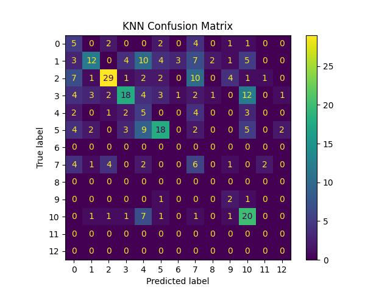
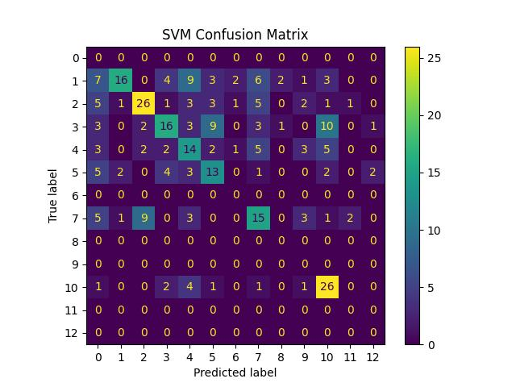

## Summary

**Authors:** [Killian Lee](@killianlee), [Michaelle Ramos](@ramosmichy23), [Michael Asfaw](@mikaellum)\
**Date:** 6/9/2025

This repository containts the final code and models for:
+ [Stripping mp3 files](strip_mp3.py) of the genre, title and music array and other metadata
+ [Extracting features](feature_extract.py) from the *.pkl files
+ [Data](final_data.csv) Used for building and testing a model
+ [Notebook](ML_Final_Notebook.ipynb) detailing the Final Model Analysis and Selections here.

## Performance

**K-NN**
+ Accuracy: 0.391
+ F1 Score: 0.423
 
 Confusion Matrix:\
 

**Random Forest**
+ Accuracy: 0.435
+ F1 Score: 0.469
 
 Confusion Matrix:\
 

**SVM**
+ Accuracy: 0.429
+ F1 Score: 0.466
 
 Confusion Matrix:\
 

 **tf NN**
+ Accuracy: 0.401
+ F1 Score: 0.417
 
 Confusion Matrix:\
 

## More Info
The database, presentations, videos and final paper can be found in [this](https://drive.google.com/drive/folders/0ADipa3ScqNmiUk9PVA) google drive.

Thank you!